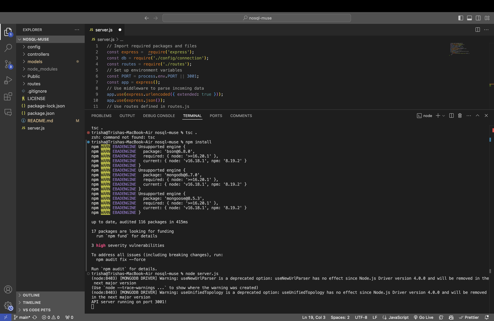
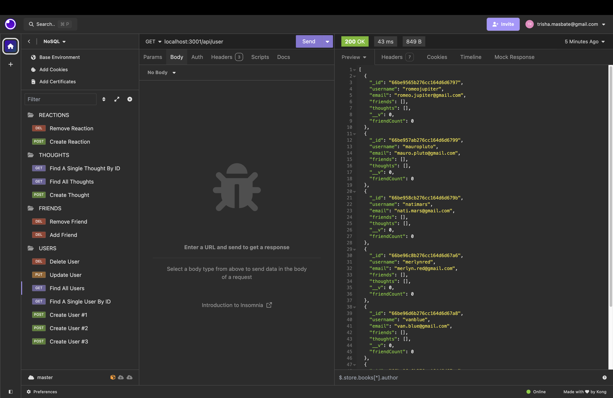

# 💭 Muse: A Social Network Web App

[](https://github.com/trishamasbate)
[](https://choosealicense.com/licenses/mit/)


## 📃 Description
**Muse** is a cutting-edge social networking web application designed to connect people, foster communication, and create a vibrant community where users can share their thoughts, engage with friends' posts, and manage their social connections seamlessly. It offers a sleek and intuitive interface powered by a robust API, providing a seamless user experience. Users can post thoughts up to 280 characters, edit or delete their posts, and view a real-time feed of their own and friends' thoughts. Reactions to posts, such as likes and loves, are supported, along with viewing reactions. Friend list management includes sending, accepting, and removing friend requests, with a personalized friend feed.

## 📌 Table of Contents
- [💭 Muse: A Social Network Web App](#-muse-a-social-network-web-app)
  - [📃 Description](#-description)
  - [📌 Table of Contents](#-table-of-contents)
  - [🔎 User Story](#-user-story)
  - [✅ Acceptance Criteria](#-acceptance-criteria)
  - [💡 Usage and Installation Instructions](#-usage-and-installation-instructions)
  - [🎞️ Previews and Walkthrough Videos:](#️-previews-and-walkthrough-videos)
  - [🗝️ Resources](#️-resources)
  - [❓ Questions](#-questions)
  - [🪪 License](#-license)

## 🔎 User Story
```md
AS A social media startup
I WANT an API for my social network that uses a NoSQL database
SO THAT my website can handle large amounts of unstructured data
```

## ✅ Acceptance Criteria
```md
GIVEN a social network API
WHEN I enter the command to invoke the application
THEN my server is started and the Mongoose models are synced to the MongoDB database
WHEN I open API GET routes in Insomnia for users and thoughts
THEN the data for each of these routes is displayed in a formatted JSON
WHEN I test API POST, PUT, and DELETE routes in Insomnia
THEN I am able to successfully create, update, and delete users and thoughts in my database
WHEN I test API POST and DELETE routes in Insomnia
THEN I am able to successfully create and delete reactions to thoughts and add and remove friends to a user’s friend list
```

## 💡 Usage and Installation Instructions
✨ **Using the GitHub Repository:**

1.	Launch an integrated terminal directly from your editor.
2.  Install the necessary packages to initialize the application. You can also execute the command `npm install`.
    - [Express.js Version 4.19.2](https://www.npmjs.com/package/express)
    - [Mongoose Version 8.5.3](https://www.npmjs.com/package/mongoose)

3.	Run the `npm start` or `node server.js` command to start the Express server.
4.  Test the functionality of the application by using Insomnia.

## 🎞️ Previews and Walkthrough Videos:

**✨ Preview**




**✨ Click on the links below for the Walkthrough Videos on Insomnia!**
- [VS Code](https://youtu.be/w25uCIo_TR4?si=U0HH7IcgB_X00Zye)
- [POST and PUT Routes for Users and Thoughts](https://youtu.be/KT0988OYxd8?si=K4MYbJTDhtxw-_Ry)
- [GET Route for ALL Users and Thoughts](https://youtu.be/6X-oWcLfBpU?si=OUQkYeFMTVmpTk3e)
- [GET Route for a SINGLE User and a SINGLE Thought](https://youtu.be/lnKrl89baAg?si=-kUssC-sW6BeMC36)
- [DELETE Route for a User and Associated Thoughts](https://youtu.be/MnO88KbUBBA?si=Q1N5h8jbnzMbrKhf)
- [POST and DELETE Routes for Friends](https://youtu.be/2l7kn9QT9yA?si=kMUWJpKa-jPK3TMb)
- [POST and DELETE Routes for Reactions](https://youtu.be/0xXF99QAsh4?si=4v1QzOamyVflf76T)
  
## 🗝️ Resources
- Dynamic JavaScript
- License Badge: [Shields.io](https://shields.io/)
- [Express.js Version 4.19.2](https://www.npmjs.com/package/express)
- [Mongoose Version 8.5.3](https://www.npmjs.com/package/mongoose)
- [Visual Studio Code](https://code.visualstudio.com/)

## ❓ Questions
Contact the author with any questions!<br>
Github link: [trishamasbate](https://github.com/trishamasbate)<br>
Email: trisha.masbate@gmail.com

## 🪪 License
This project is [MIT](https://choosealicense.com/licenses/mit/) licensed.<br />

Copyright © 2024 [TRISHA MASBATE](https://github.com/trishamasbate)
  
<hr>
<p align='center'><i>
All the best! 🤟🏻 TRISHA MASBATE
</i></p>